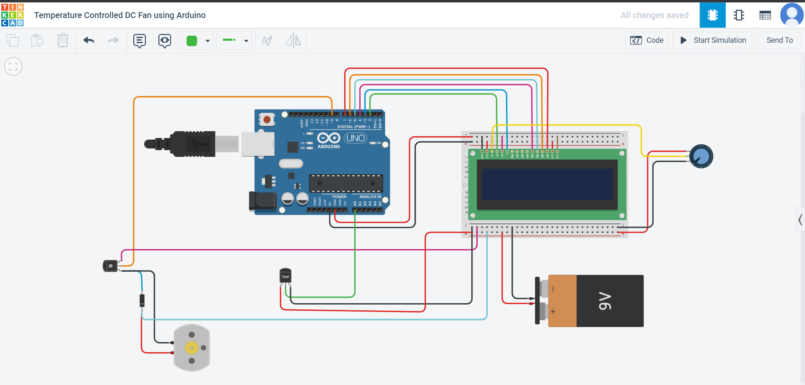

# 🌡️ Temperature Controlled DC Fan Project

This project implements a **temperature-controlled DC fan** system using Arduino. The fan turns on when the temperature reaches a predefined threshold and turns off automatically when it falls below that threshold. This system is useful for applications where automatic temperature regulation is needed.

---

## 📖 Introduction

The **Temperature Controlled DC Fan** is an Arduino-based system that automates the operation of a DC fan based on the temperature of the surrounding environment. By using a temperature sensor, the system continuously monitors the ambient temperature and triggers the fan when the temperature exceeds a certain limit.

---

## 🎯 Project Overview

The goal of this project is to design and develop a system that automatically operates a fan based on temperature changes. The fan switches ON when the temperature is equal to or above 30°C and switches OFF when the temperature is below 30°C.

- **Components Used**: Arduino, LM35 temperature sensor, DC fan, Relay module, Power supply.
- **Objective**: Automating the fan operation using an Arduino controller.

---

## 🛠️ Block Diagram

The block diagram below shows the functional structure of the system:

---

## 📝 Circuit Diagram

The circuit connects the Arduino, temperature sensor, relay module, and fan. Below is the schematic diagram showing the connections:

---

## 🧑‍🔬 Methodology

The system uses an **LM35 temperature sensor** to measure the room temperature. Based on the temperature readings, the Arduino triggers the fan's operation:

1. **When the temperature is less than 30°C**, the fan remains OFF.
2. **When the temperature is greater than or equal to 30°C**, the fan turns ON.

Below is the flowchart that explains the working of the system:

### How It Works:

1. The LM35 sensor continuously reads the ambient temperature.
2. The sensor data is sent to the Arduino.
3. If the temperature is **less than 30°C**, the fan stays OFF.
4. If the temperature is **equal to or greater than 30°C**, the relay module activates the fan.

---

## 🔌 Hardware Implementation

Here are real-world images of the implemented hardware:

### Hardware Setup:

### Fan OFF when temperature is below 30°C:
.jpg)

### Fan ON when temperature is 30°C or above:
.jpg)

---

## 💻 Source Code

The source code for the Arduino is written in the **C++** programming language. It reads the temperature from the sensor and controls the relay accordingly.

You can view the source code in the [SourceCode.ino](./SourceCode.ino) file.

---

## 🔮 Future Scope

There are several potential improvements that can be made to this system:
- Adding **Bluetooth** or **Wi-Fi** modules for remote monitoring of the temperature.
- Integrating a **cooling system** or **heater** for maintaining an optimal temperature.
- Displaying real-time data on a **LCD** screen for better visualization.

---

## 🏁 Conclusion

This project demonstrates an effective way to control a fan based on temperature readings using Arduino. It can be easily adapted to control other devices based on environmental conditions, making it a versatile solution for automated systems.

---

## 📞 Contact

For any questions or further information, feel free to contact me:
- **Gowtham Varshith**
- **Email:** gowthamb461@gmail.com
- **GitHub:** [Gowtham Varshith](https://github.com/Gowtham-Varshith)

---

